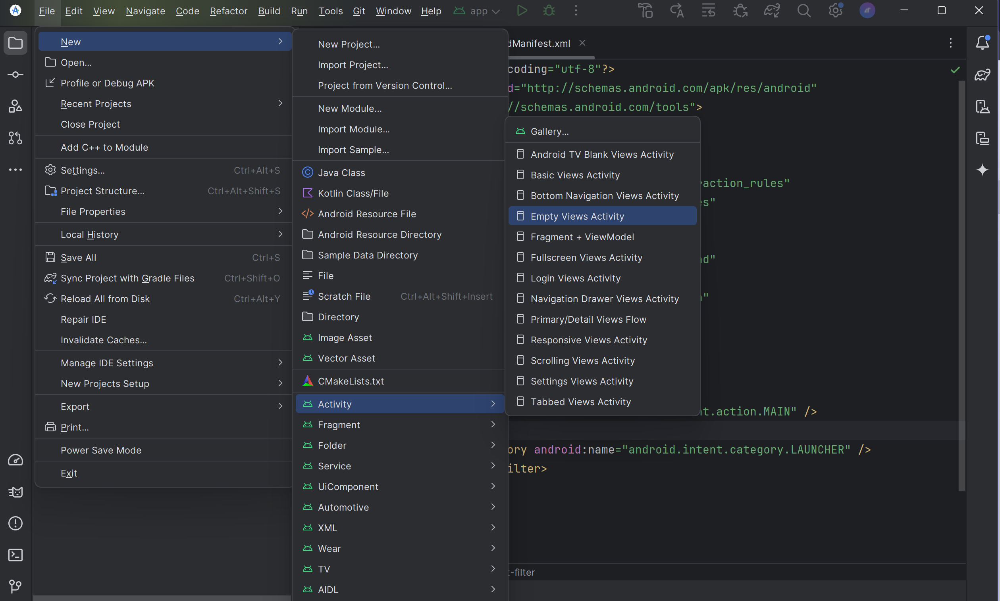

## Что за компонент Activity?

Activity в Android — это один из ключевых компонентов, отвечающий за создание пользовательского интерфейса приложения. 
Она представляет собой отдельный экран, на котором размещаются различные элементы управления и интерфейса, такие как кнопки, текстовые поля и изображения.

По сути активити - это окно, с которым пользователь взаимодействует. И в этом окне можно “нарисовать” какой-либо пользовательский интерфейс. 

В Android каждое приложение может состоять из одной или нескольких активностей.

Одна из активити может быть отмечена как основная (или главная) и тогда она будет появляться первой при запуске приложения. 
А уже из нее можно запустить другие активити. Причем не только те, которые принадлежат текущему приложению, но и активити из других приложений. 
Может показаться, что все запускаемые активити являются частями одного приложения. На самом же деле они могут быть определены в разных приложениях и работать в разных процессах.

У активности есть, который включает несколько состояний.

## Как создать Activity?

Так как же нам создать экран в нашем приложении для дальнейшего взаимодействия с ним?

### Тяжёлый, но полезный для понимания способ №1

Первым делом надо создать новый класс, который должен наследоваться от класса `Activity` или `AppCompatActivity` и переопределять метод `onCreate()`

``` kotlin
class MainActivity : AppCompatActivity() {

  override fun onCreate(savedInstanceState: Bundle?) {
    super.onCreate(savedInstanceState)
  }
}
```

Далее надо создать интерфейс нашей активити, для этого нужно создать файл макета в папке `app/src/main/res/layout` 
с любым именем и с расширением `.xml`

Принято называть файлы активити в стиле `snake_case`, а так же в названии файла указывать, что это именно файл активити, например `activity_log_in.xml`, а не просто `log_in.xml`

Создадим нужную нам разметку:

``` xml
// файл: res/layout/activity_log_in.xml

<LinearLayout
    xmlns:android="http://schemas.android.com/apk/res/android"
    xmlns:tools="http://schemas.android.com/tools"
    android:layout_width="match_parent"
    android:layout_height="match_parent"
    android:orientation="vertical"
    tools:context=".MainActivity">
    
    ...
    
</LinearLayout>
```

Теперь эту разметку нужно “подключить” к активити в методе `onCreate()`.

 ``` kotlin
 class MainActivity : AppCompatActivity() {

  override fun onCreate(savedInstanceState: Bundle?) {
    super.onCreate(savedInstanceState)
    setContentView(R.layout.activity_log_in)  // подключаем разметку указывая свой файл
  }
}
 ```

И наконец зарегистрируем ее в манифесте с помощью `<activity>`:
``` xml
<?xml version="1.0" encoding="utf-8"?>
<manifest ... >
    <application ... >
        <activity android:name=".MainActivity" />
    </application>
</manifest>
```

### Простой и быстрый способ №2

В Android Studio есть стандартные шаблоны: правой кнопкой мыши вызываем контекстное меню и в нём выбираем \
`New -> Activity -> и выбираем нужный шаблон`


и тогда Android Studio сделает всё за нас, создадутся нужные файлы и активити уже будет зарегистрированно в манифесте

## Как пометить Activity основной (главной)?

Чтобы пометить Activity как основную (главную) в приложении Android, необходимо внести изменения в файл манифеста `AndroidManifest.xml`. 

Это делается с помощью добавления специального фильтра `intent-filter` к нужной активности.

``` xml
<activity android:name=".MainActivity">
    <intent-filter>
        <action android:name="android.intent.action.MAIN" />
        <category android:name="android.intent.category.LAUNCHER" />
    </intent-filter>
</activity>
```

`android.intent.action.MAIN` - Этот фильтр указывает, что данная активность является основной точкой входа в приложение

`android.intent.category.LAUNCHER` - Этот фильтр позволяет активности отображаться в списке приложений на устройстве, что делает её доступной для запуска пользователем

## Еще подробнее?
* [Жизненный цикл Activity](Жизненный%20цикл%20Activity%20(Активити).md)


## Какие вопросы могли возникнуть?
* [Что за компоненты Android?](../Основные%20компоненты%20Android.md)
* [Что за манифест (`AndroidManifest.xml`)?](../Манифест%20или%20AndroidManifest.md)

